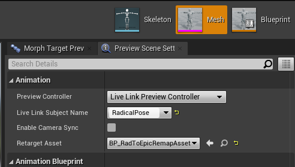
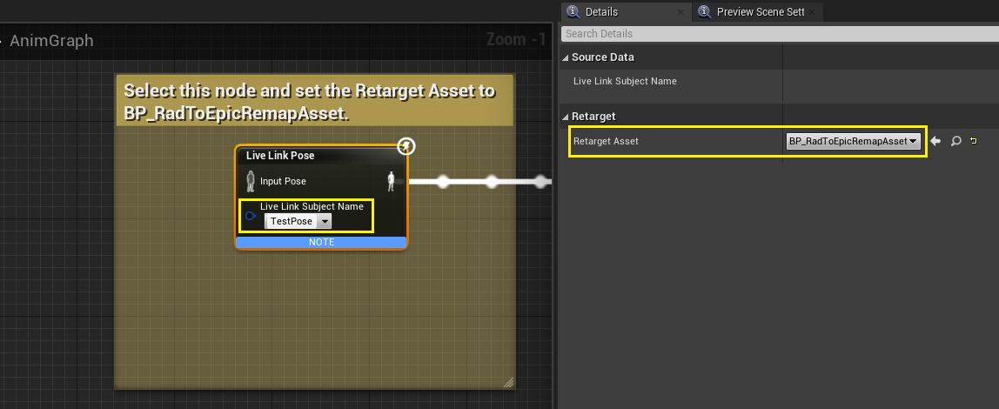
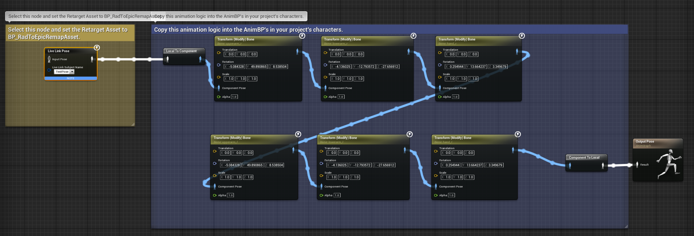

# Radical <-> Unreal Live Link Remap Plugin

This plugin contains retargeting assets for converting animation output from RADiCAL Studio to an Unreal Engine editor session. It will receive data from a local RADiCAL Studio session, either on the same computer or over the local network.

## Initial Setup Instructions

To install, download the latest release for your engine version from the [Releases section](https://github.com/get-rad/UnrealLiveLinkRemapPlugin/releases). Unzip to your project `/Plugins` or engine `Marketplace` folder, then enable the plugin in your project.

After starting the Live Link stream from Radical Studio, open the UE4 editor and go to Window -> Live Link. Go to Source -> Message Bus Source -> select the `RadLiveLink` source. You can now close this window.

## Live Link Preview

We have provided two mannequins, one with the Epic skeleton and the other for the Radical skeleton. The Radical skeleton can be used as ground-truth for verifying animation data.

The Live Link data can be previewed inside the Skeleton, Skeletal Mesh, or Animation Blueprint windows for a given skeletal asset. 

On the right side, go to Preview Scene Settings, under Animation, change the Preview Controller to Live Link Preview Controller. Then, change the Live Link Subject Name to `RadicalPose`.

For Retarget Asset, select the corresponding Remap Asset file for that skeleton. For example, for the Radical mannequin, choose the `RadToRadRemap` asset. For an Epic skeleton (either the provided Epic mannequin, or your project-specific character), choose the `BP_RadToEpicRemapAsset`. Assuming the target character uses an Epic skeleton, it should look as follows:

## Live Link Source in AnimBP

To apply the incoming animation data to the characters in the scene, go to the AnimBP for the character and create a Live Link Pose node. Select the a) Live Link Subject Name and b) the Retarget Asset, like so:

Because of the difference between the RADiCAL skeleton (which defaults to a T pose) and the Unreal skeleton (which defaults to an A pose) we have to apply some rotations at the shoulder. Refer to the `AnimBP_EpicGames_Mannequin` AnimGraph and copy these transform nodes to your character:

## Rotation conversions for non-Epic skeletons (advanced users)

To account for some of the differences between the Radical Studio coordinate frame and Unreal, we have flipped the incoming LiveLink data's rotation and position axes. If you want to delve into the source C++, you can inspect the conversions at the `RadicalLiveLinkRemapAssetBase` class and its child classes. We expect that other skeletons will require different rotation adjustments, including swapping axes. We exposed three overridable methods to implement the root bone position, root bone rotation, and non-root bone rotation conversions. Please note that the AI output in Radical Studio uses the hip bone as a root, so position data should be mapped to the hips (or pelvis) in the target skeleton.
